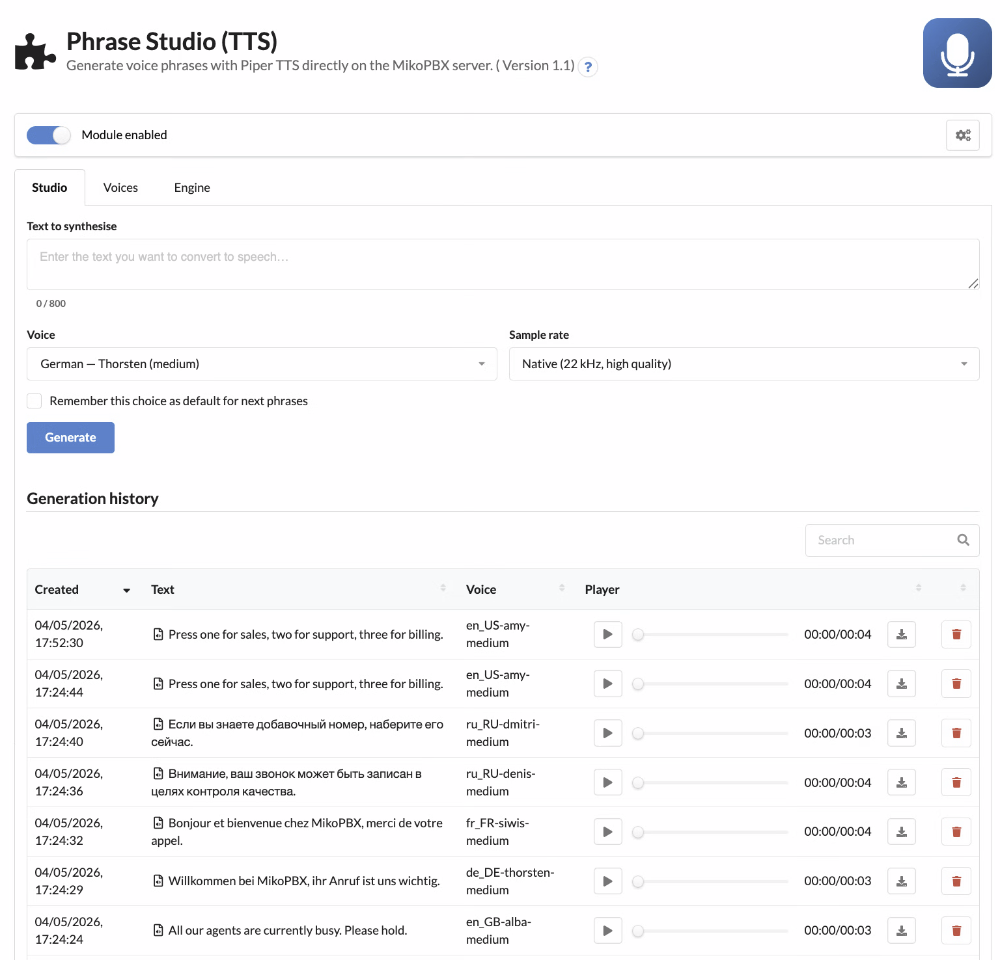
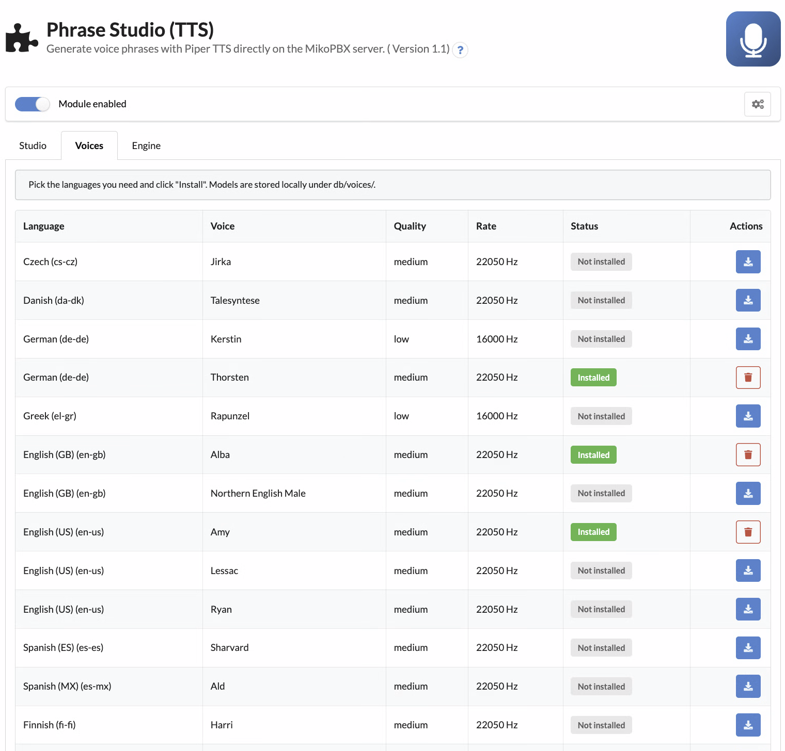
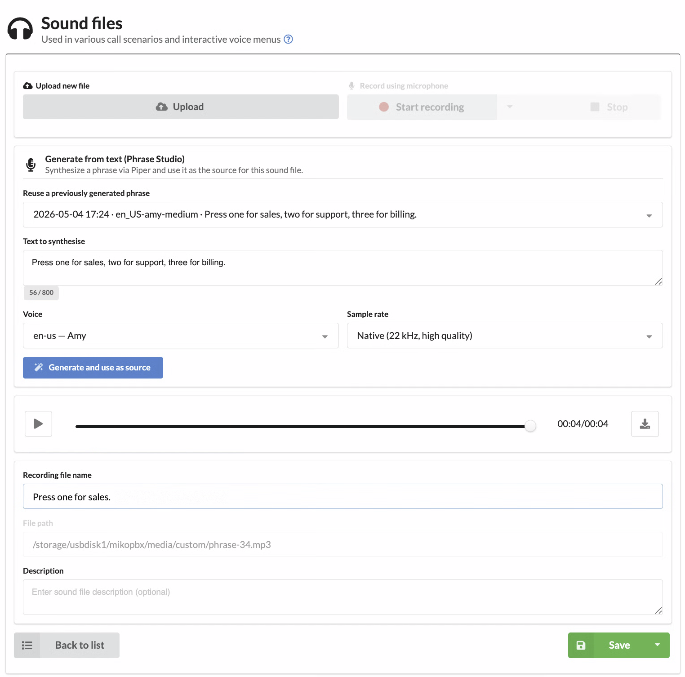

[](https://github.com/mikopbx/ModulePhraseStudio/actions/workflows/build.yml) [](https://www.gnu.org/licenses/gpl-3.0) [](https://github.com/mikopbx/ModulePhraseStudio/releases) [](https://www.php.net/) [](https://github.com/rhasspy/piper) [](https://www.mikopbx.com/) [](https://github.com/mikopbx/ModulePhraseStudio/issues)

[English](README.md) | [Русский](README.ru.md)

# ModulePhraseStudio

Offline text-to-speech (TTS) studio for MikoPBX, powered by [Piper TTS](https://github.com/rhasspy/piper). Generate voice phrases right on the PBX server, browse a searchable history, and turn any phrase into an Asterisk-ready sound file in two clicks — without paid cloud services or sending your scripts to a third party.



## Why Phrase Studio

- **Fully offline.** The Piper engine and the voice models live on the PBX. No outbound API calls, no per-character billing, no GDPR headache.
- **Sounds natural.** Piper neural voices produce broadcast-quality narration in 25+ languages — far closer to a real person than the legacy `say.cgi` / festival TTS.
- **Works inside the PBX you already use.** A new "Generate from text" block appears directly in the standard Sound Files editor (see screenshot below), so an IVR menu, voicemail greeting or queue announcement can be authored without leaving MikoPBX.
- **Reuse, don't re-record.** Every generated phrase is cached and re-listenable from the searchable history. Edit the wording, regenerate, A/B compare — the file already in production keeps playing until you save the replacement.

## Features

- Inline TTS studio with text editor, voice picker, sample-rate switch and live audio preview
- Searchable generation history — click any row to repopulate the form with text + voice
- Twenty-five languages out of the box (English × multiple regional accents, Russian, German, French, Italian, Spanish, Polish, Portuguese, Czech, Ukrainian, Chinese, …)
- Per-voice install / uninstall — pull only the languages you actually use; models live under `db/voices/`
- One-click "Generate from text" block injected into the core Sound Files modify page (no core fork)
- High-quality preview MP3 (22 kHz / 128 kbit/s) instead of MikoPBX's default 8 kHz "telephony" rendering
- Filenames auto-derived from the phrase text via Cyrillic→Latin transliteration (e.g. *"Здравствуйте, спасибо за ваш звонок"* → `Zdravstvujte_spasibo_za_vas_zvonok.wav`)
- Cache pruning so the phrase library never grows unbounded
- Fully attributed REST API v3 — script your IVR build pipeline if you want
- Disabled-state aware: when the module is off the page is read-only and makes zero REST calls

## Screenshots

### Studio — generate, listen, reuse


### Voices — pick the languages you need



### Sound Files hook — generate phrases inside the IVR/sound editor



## Installation

### From the MikoPBX Marketplace

1. Open the MikoPBX web interface.
2. Navigate to **Modules** → **Marketplace**.
3. Find **Phrase Studio (TTS)** and click **Install**.
4. Enable the module on **Modules** → **Installed**.

### Manual installation

1. Download the latest `.zip` from the [Releases](https://github.com/mikopbx/ModulePhraseStudio/releases) page.
2. In MikoPBX, go to **Modules** → **Installed** → **Upload module** and pick the `.zip`.
3. Enable the module.

## First run

1. Open **Modules → Phrase Studio (TTS)**. As soon as the module is enabled, the Piper binary (≈ 25 MB, statically linked, architecture-matched) is auto-downloaded in the background into `db/piper/` and the upstream voice catalogue is refreshed. The **Engine** tab flips to *installed* automatically once the tarball lands.
2. If the auto-bootstrap was skipped (no internet, air-gapped install) you can still trigger it manually: open the **Engine** tab and click **Install engine**. The same button doubles as **Update engine** — it re-downloads the tarball even when a working binary is already present (sends `force=true`).
3. Switch to the **Voices** tab, find the language(s) you need and click **Install** on each. Models are 30–60 MB each and end up in `db/voices/`. Voice download is asynchronous: the row immediately shows an *Installing…* spinner and flips to *Installed* (or *Failed* with an error) once the background process finishes — you can leave or reload the page and the spinner keeps tracking real progress.
4. Go back to the **Studio** tab, type a phrase, pick a voice, hit **Generate**. The result lands in the history list with a built-in player.

Toggle **Remember as default** to make the current voice and sample-rate the new defaults for the next phrase.

## Inline use in Sound Files

Open any IVR / custom sound file — *Sound Files → Create*, or any existing entry in the *custom* category — and a **"Generate from text (Phrase Studio)"** block appears between the upload/record area and the file properties:

- *Reuse a previously generated phrase* — pick one from history; the audio source updates instantly, no re-encoding needed.
- *Generate and use* — type new text and the resulting WAV becomes the form's source file. The high-quality MP3 plays in the standard MikoPBX player; the Asterisk-format derivatives (`ulaw`, `alaw`, `gsm`, `g722`, `sln`) are produced at the rates Asterisk requires.

The hook is intentionally hidden for **MOH** (music-on-hold) files — Phrase Studio is for speech, not background music.

## REST API v3

Auto-discovered via PHP 8 attributes. All endpoints under `/pbxcore/api/v3/module-phrase-studio/`. Auth: localhost or Bearer token.

| Method | Endpoint | Description |
|---|---|---|
| GET    | `engine`                                | Engine status (installed, version)      |
| POST   | `engine:install`                        | Install the Piper binary; pass `{"force":true}` to force a re-download (Update flow) |
| DELETE | `engine`                                | Remove the Piper binary                 |
| GET    | `voices`                                | Catalogue + installed flag per voice. Optional query: `language=ru-ru`, `installed_only=true` |
| POST   | `voices:install`                        | **Async.** Queues a voice download and returns `202 Accepted` with `install_status="installing"` — poll `GET voices` to watch the row flip to `installed` / `failed` |
| DELETE | `voices/{id}`                           | Remove a voice model                    |
| GET    | `phrases`                               | Phrase history                          |
| POST   | `phrases`                               | Generate (or return cached) phrase      |
| GET    | `phrases/{id}:download`                 | Stream the WAV (HEAD = duration probe)  |
| POST   | `phrases/{id}:promoteToTmp`             | Stage WAV for Sound Files import        |
| DELETE | `phrases/{id}`                          | Remove a single history entry           |

Voice rows returned by `GET voices` carry the async-install status fields the UI uses to drive its loader: `install_status` (`""` / `"installing"` / `"installed"` / `"failed"`) and `install_error` (set only when status is `failed`). A row stuck in `installing` for over five minutes is auto-flipped to `failed` with a synthetic timeout message, so a poll loop will eventually converge without manual cleanup.

Example — generate a phrase from a script:

```bash
curl -X POST -H "Authorization: Bearer $TOKEN" \
  -H "Content-Type: application/json" \
  -d '{"text":"Welcome to MikoPBX","voice_id":"en_US-amy-medium","sample_rate":"telephony"}' \
  https://pbx.example.com/pbxcore/api/v3/module-phrase-studio/phrases
```

Example — install a voice and poll until ready:

```bash
curl -X POST -H "Authorization: Bearer $TOKEN" \
  -H "Content-Type: application/json" \
  -d '{"voice_id":"en_US-amy-medium"}' \
  https://pbx.example.com/pbxcore/api/v3/module-phrase-studio/voices:install
# → 202 {"voice_id":"en_US-amy-medium","install_status":"installing","queued":true,...}

curl -H "Authorization: Bearer $TOKEN" \
  "https://pbx.example.com/pbxcore/api/v3/module-phrase-studio/voices?installed_only=true"
# → poll until the row shows install_status="installed"
```

## Architecture

```
Module package           — small (~150 KB), no binaries shipped
Piper engine             — db/piper/                    (~25 MB,  on demand)
Voice models (.onnx)     — db/voices/                   (30–60 MB each, on demand)
Generated phrases        — db/phrases/                  (md5(text+voice+rate).wav)
Module DB (history,
  voices, settings)      — db/module.db                 (SQLite)
```

The module ships empty — engine and voices are downloaded from GitHub releases / the official Piper voice repository the first time the user clicks **Install**, so the marketplace artefact stays small and air-gapped installations can preload the binaries by dropping them into the corresponding `db/` subfolders.

## Synthesis quality knobs

- **Sample rate** — *Native (22 kHz)* for studio-quality previews / VoIP HD codecs (g.722, opus); *Telephony (8 kHz mono)* for legacy g.711 trunks.
- **Max text length** — defaults to 800 characters (~60 s of speech). Longer phrases are rejected to protect the worker.
- **Cache size limit** — defaults to 500 phrases; the oldest entries are pruned automatically.

## Requirements

- MikoPBX **2026.1.223+**
- PHP **8.4**
- ~50 MB free disk for the engine + each installed voice
- Outbound HTTPS access during the first install (engine + voice download)

## Support

- **Issues:** [GitHub Issues](https://github.com/mikopbx/ModulePhraseStudio/issues)
- **Telegram:** [@mikopbx_dev](https://t.me/mikopbx_dev)

## License

GPL-3.0-or-later. Piper TTS is MIT-licensed; voice models are distributed under their respective licences (mostly MIT / CC-BY).
