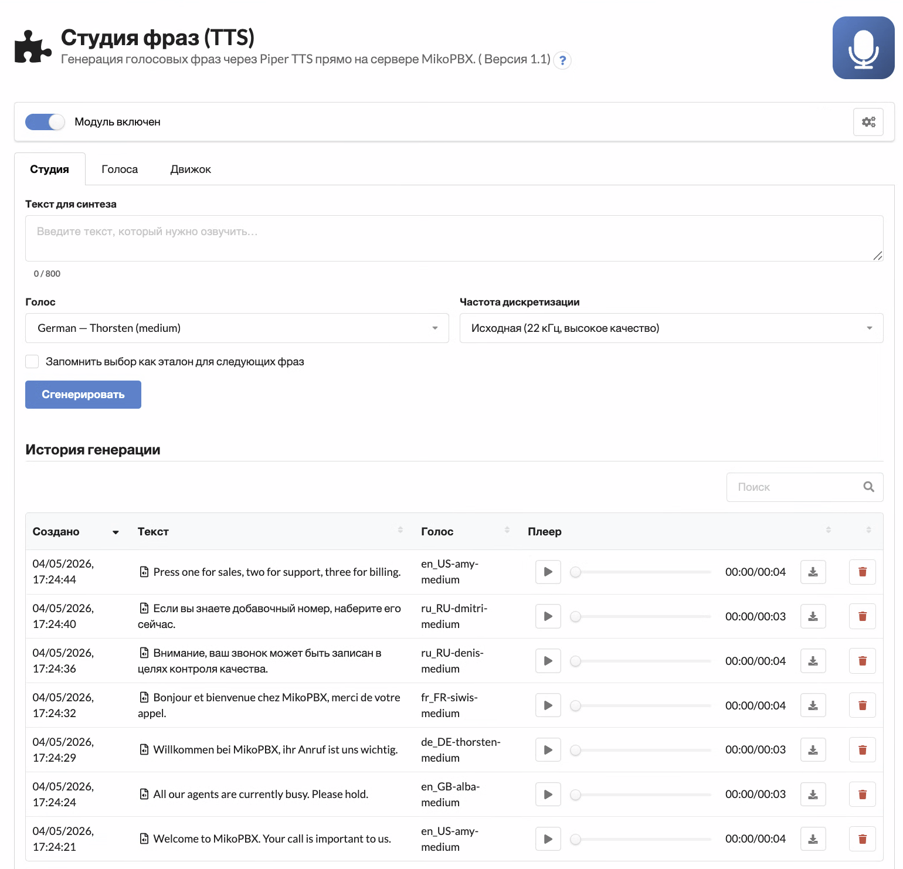
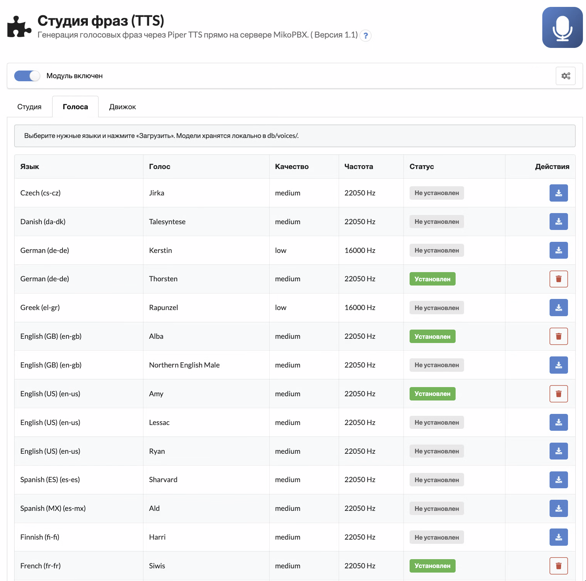
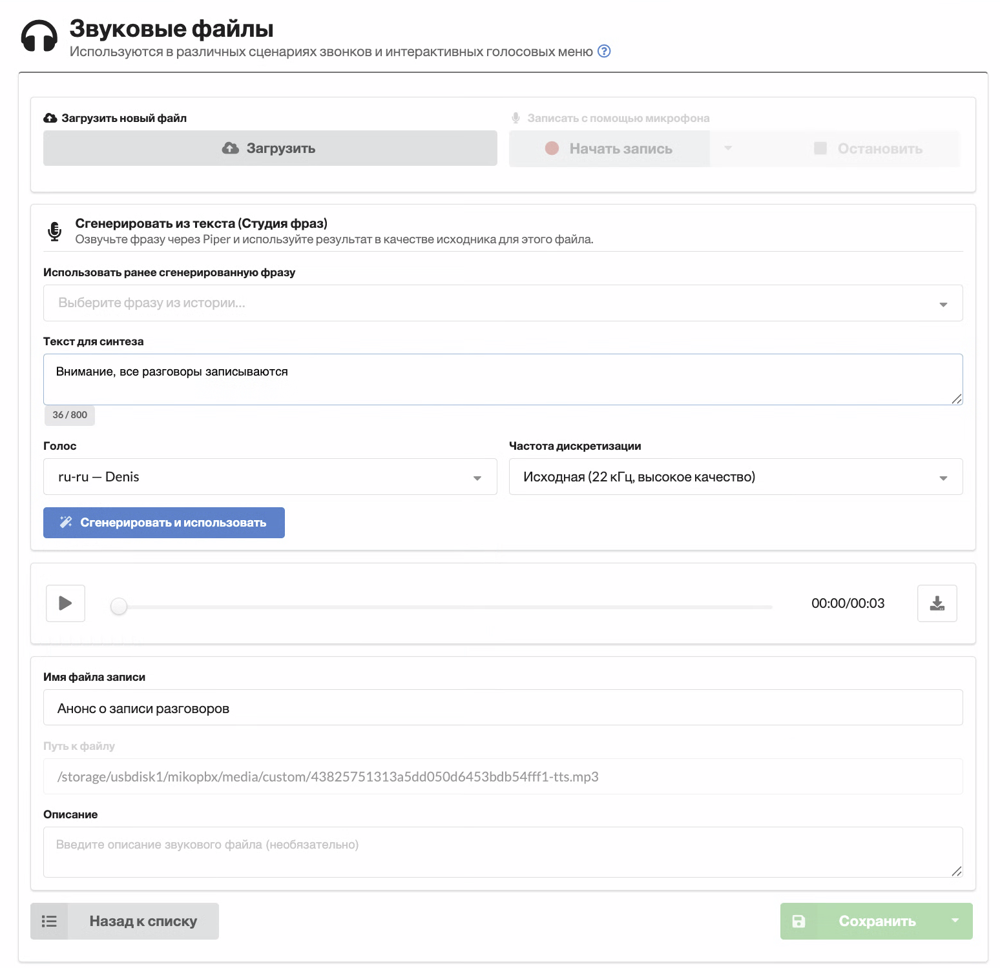

[](https://github.com/mikopbx/ModulePhraseStudio/actions/workflows/build.yml) [](https://www.gnu.org/licenses/gpl-3.0) [](https://github.com/mikopbx/ModulePhraseStudio/releases) [](https://www.php.net/) [](https://github.com/rhasspy/piper) [](https://www.mikopbx.com/) [](https://github.com/mikopbx/ModulePhraseStudio/issues)

[English](README.md) | [Русский](README.ru.md)

# ModulePhraseStudio — Студия фраз

Офлайн-студия синтеза речи (TTS) для MikoPBX на базе [Piper TTS](https://github.com/rhasspy/piper). Генерируйте голосовые фразы прямо на сервере АТС, ведите поисковую историю и одной кнопкой превращайте любую фразу в готовый звуковой файл Asterisk — без облачных сервисов, без оплаты «по символам» и без передачи ваших скриптов наружу.



## Зачем это нужно

- **Полностью офлайн.** Бинарь Piper и голосовые модели лежат на самой АТС. Ноль исходящих API-запросов, ноль платы «за каждый символ», ноль головной боли по 152-ФЗ / GDPR.
- **Звучит естественно.** Нейросетевые голоса Piper дают качество студийной озвучки на 25+ языках — это не тот «робот», что выдавал старый `say.cgi` / festival.
- **Встроено в привычный интерфейс.** Прямо в стандартном редакторе «Звуковых файлов» появляется блок «Сгенерировать из текста» (см. скриншот ниже). IVR-меню, приветствие почтового ящика или объявление в очереди можно сделать, не покидая MikoPBX.
- **Не перезаписывайте — переиспользуйте.** Каждая сгенерированная фраза попадает в поисковую историю. Меняйте формулировки, перегенерируйте, сравнивайте варианты — файл, который сейчас играет в проде, никуда не денется до того момента, как вы сохраните замену.

## Возможности

- Встроенная TTS-студия: текстовое поле, выбор голоса, переключатель частоты дискретизации, плеер с предпрослушкой
- Поисковая история генераций — клик по строке заполняет форму её текстом и голосом
- 25 языков «из коробки» (английский в нескольких региональных акцентах, русский, немецкий, французский, итальянский, испанский, польский, португальский, чешский, украинский, китайский, …)
- Установка / удаление по голосу — качаете только нужные языки; модели лежат в `db/voices/`
- Блок «Сгенерировать из текста», встроенный в core-страницу «Звуковые файлы → Изменить» (без форка ядра)
- Высококачественный preview-MP3 (22 кГц / 128 кбит/с) вместо «ведра» (8 кГц), которое выдаёт стандартная конвертация MikoPBX
- Имя файла собирается из текста фразы с транслитерацией кириллицы (например, *«Здравствуйте, спасибо за ваш звонок»* → `Zdravstvujte_spasibo_za_vas_zvonok.wav`)
- Прунинг кэша — библиотека фраз не растёт бесконечно
- Полный REST API v3 — встраивайте генерацию IVR-меню в свои пайплайны
- Учёт состояния модуля: если модуль выключен, страница работает в read-only и не делает ни одного REST-запроса

## Скриншоты

### Студия — генерация, прослушивание, переиспользование


### Голоса — установите только нужные языки



### Хук в «Звуковых файлах» — генерация прямо из редактора IVR



## Установка

### Из маркетплейса MikoPBX

1. Откройте веб-интерфейс MikoPBX.
2. Перейдите в **Модули** → **Маркетплейс**.
3. Найдите **«Студия фраз (TTS)»** и нажмите **Установить**.
4. Включите модуль на странице **Модули** → **Установленные**.

### Ручная установка

1. Скачайте свежий `.zip` со страницы [Releases](https://github.com/mikopbx/ModulePhraseStudio/releases).
2. В MikoPBX зайдите в **Модули** → **Установленные** → **Загрузить модуль** и выберите архив.
3. Включите модуль.

## Первый запуск

1. Откройте **Модули → Студия фраз (TTS)**.
2. Перейдите на вкладку **«Движок»** и нажмите **«Установить движок»** — бинарь Piper (≈ 25 МБ, статически слинкован, под архитектуру вашей АТС) попадёт в `db/piper/`.
3. На вкладке **«Голоса»** найдите нужные языки и нажмите **«Загрузить»** на каждом. Модели весят 30–60 МБ и складываются в `db/voices/`.
4. Вернитесь на вкладку **«Студия»**, введите фразу, выберите голос, жмите **«Сгенерировать»**. Результат появится в истории с встроенным плеером.

Чекбокс **«Запомнить выбор как эталон»** делает текущий голос и частоту дискретизации значениями по умолчанию для следующих фраз.

## Использование в редакторе звуковых файлов

Откройте любой пользовательский звуковой файл — *Звуковые файлы → Создать*, либо любую существующую запись категории *custom* — и между блоком «Загрузить / записать с микрофона» и блоком свойств файла появится **«Сгенерировать из текста (Студия фраз)»**:

- *Использовать ранее сгенерированную фразу* — выберите запись из истории; источник в форме обновляется мгновенно, без перекодирования.
- *Сгенерировать и использовать* — введите новый текст, и результат становится исходным файлом формы. Высококачественный MP3 играется в стандартном плеере MikoPBX, а Asterisk-форматы (`ulaw`, `alaw`, `gsm`, `g722`, `sln`) генерируются на той частоте, которой требует Asterisk.

Для категории **MOH** (музыка на удержании) блок не показывается — Студия фраз про речь, а не про фоновую музыку.

## REST API v3

Авто-обнаружение через PHP 8 атрибуты. Все эндпоинты под `/pbxcore/api/v3/module-phrase-studio/`. Авторизация: localhost или Bearer-токен.

| Метод  | Эндпоинт                                | Описание                                  |
|--------|-----------------------------------------|-------------------------------------------|
| GET    | `engine`                                | Статус движка (установлен, версия)        |
| POST   | `engine:install`                        | Скачать и установить бинарь Piper         |
| DELETE | `engine`                                | Удалить бинарь Piper                      |
| GET    | `voices`                                | Каталог + флаг установки по каждому голосу |
| POST   | `voices:install`                        | Скачать модель голоса                     |
| DELETE | `voices/{id}`                           | Удалить установленный голос               |
| GET    | `phrases`                               | История генераций                         |
| POST   | `phrases`                               | Сгенерировать (или вернуть кэш) фразы     |
| GET    | `phrases/{id}:download`                 | Поток WAV (HEAD = длительность)           |
| POST   | `phrases/{id}:promoteToTmp`             | Подготовить WAV для импорта в SoundFiles  |
| DELETE | `phrases/{id}`                          | Удалить одну запись из истории            |

Пример — генерация фразы из скрипта:

```bash
curl -X POST -H "Authorization: Bearer $TOKEN" \
  -H "Content-Type: application/json" \
  -d '{"text":"Здравствуйте, спасибо за ваш звонок","voice_id":"ru_RU-irina-medium","sample_rate":"telephony"}' \
  https://pbx.example.com/pbxcore/api/v3/module-phrase-studio/phrases
```

## Архитектура

```
Пакет модуля             — компактный (~150 КБ), без бинарей
Движок Piper             — db/piper/                    (~25 МБ, по требованию)
Голосовые модели (.onnx) — db/voices/                   (30–60 МБ каждая, по требованию)
Сгенерированные фразы    — db/phrases/                  (md5(текст+голос+rate).wav)
БД модуля (история,
  голоса, настройки)     — db/module.db                 (SQLite)
```

Модуль приходит «пустым» — движок и голоса скачиваются с GitHub Releases / официального репозитория голосов Piper при первом нажатии **«Установить»**. За счёт этого пакет в маркетплейсе остаётся компактным, а в air-gapped-инсталляциях бинари можно подложить заранее в нужные подкаталоги `db/`.

## Тонкая настройка качества

- **Частота дискретизации** — *Исходная (22 кГц)* для студийных предпрослушек и HD-кодеков (g.722, opus); *Телефонная (8 кГц моно)* для классических g.711 транков.
- **Максимальная длина текста** — по умолчанию 800 символов (~60 секунд речи). Более длинные фразы отклоняются — это защищает воркер.
- **Размер кэша** — по умолчанию 500 фраз; самые старые автоматически вытесняются.

## Требования

- MikoPBX **2026.1.223+**
- PHP **8.4**
- ~50 МБ свободного места под движок плюс по столько же под каждый голос
- Доступ в интернет по HTTPS на момент первой установки (скачивание движка и голосов)

## Поддержка

- **Issues:** [GitHub Issues](https://github.com/mikopbx/ModulePhraseStudio/issues)
- **Telegram:** [@mikopbx_dev](https://t.me/mikopbx_dev)

## Лицензия

GPL-3.0-or-later. Piper TTS распространяется под MIT; голосовые модели — под собственными лицензиями (преимущественно MIT / CC-BY).
